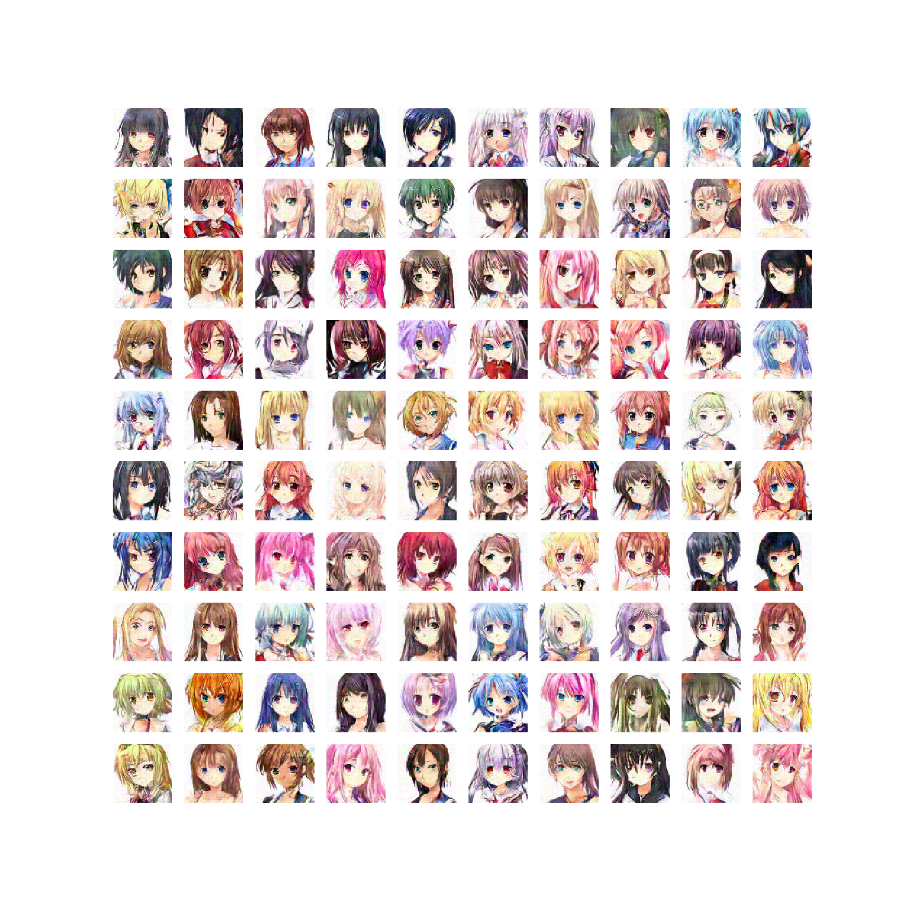
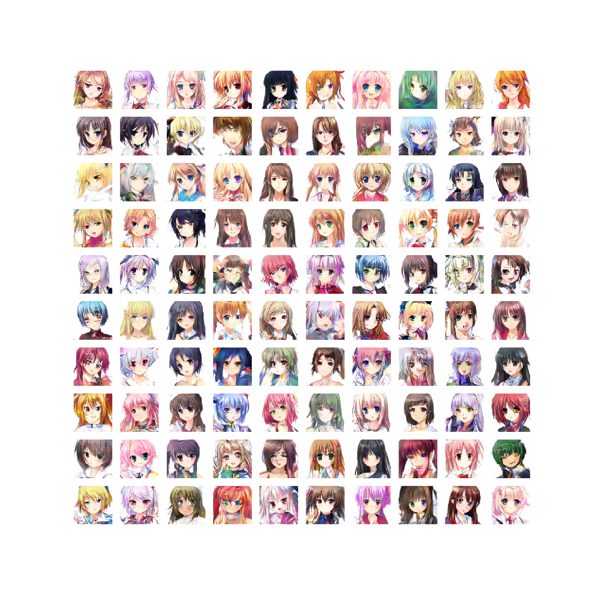
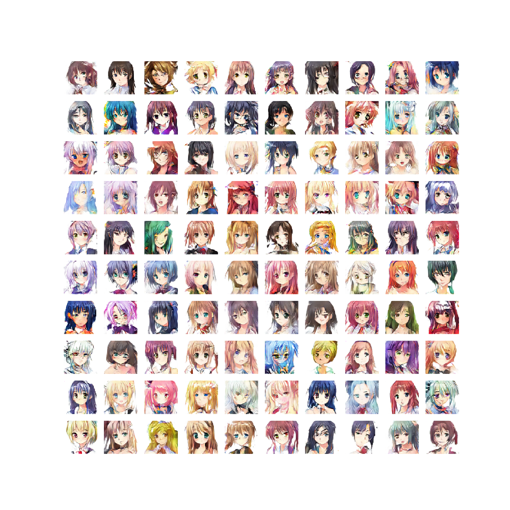
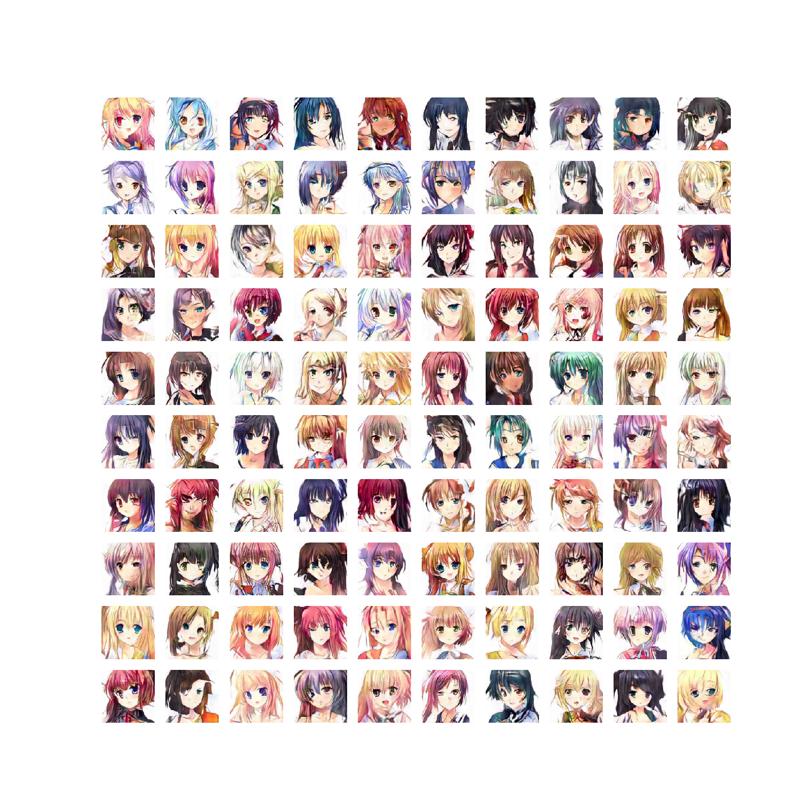
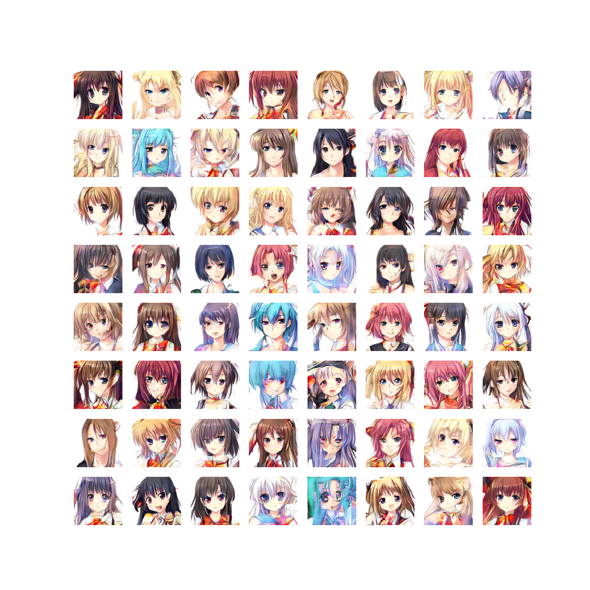
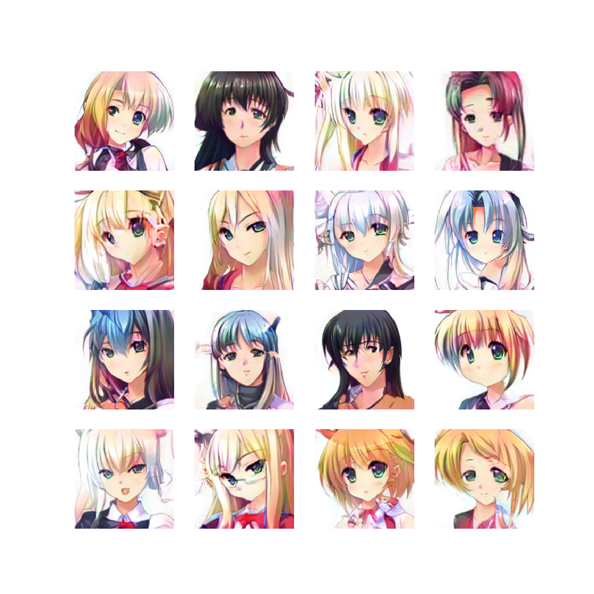

# Illustration-Generator

様々なGANを用いてイラスト生成を行っていく。詳細はそれぞれのディレクトリのREADME.mdに記す。

## Dataset
それぞれの実験においては、共通のデータセットを用いている。
[Getchu](http://www.getchu.com/)のサイトからスクレイピングしている。このサイトを選んだ意図は[こちら](https://medium.com/@crosssceneofwindff/gan%E3%82%92%E7%94%A8%E3%81%84%E3%81%9F%E3%82%A4%E3%83%A9%E3%82%B9%E3%83%88%E7%94%9F%E6%88%90%E3%81%AE%E3%83%87%E3%83%BC%E3%82%BF%E3%82%BB%E3%83%83%E3%83%88-f2a9171e7ec5)  
前処理としては
- Opencv + lbpcascade_animeface.xmlで顔検出してクラップ
- クラップした画像を64×64 or 128×128にリサイズ
- Opencvで読み込んでいるため、BGR -> RGBに戻す
- chainerにおけるネットワーク入力形式に合わせるため、(height, width, channel)を(channel, height, width)にする
- 値を-1から1の値へと集約
- `.npy`形式に格納

以上の処理を行い、以下に示す二つのデータセットを用意した。
- 64×64の顔画像25000枚
- 128×128の顔画像15000枚

RaGAN以外は64 * 64のデータセットを用いている。  
勿論、GPUのメモリ上この枚数としているだけであってメモリが許す限りデータ枚数は増やしたほうが良い。

## Quick Results
### DCGAN  
Paper -> [here](https://arxiv.org/abs/1511.06434 "here")  
Reference -> [here](https://github.com/mattya/chainer-DCGAN/blob/master/DCGAN.py "here")  
Input size : 64×64  

### DRAGAN  
Paper -> [here](https://arxiv.org/abs/1705.07215 "here")  
Input size : 64×64

### ProgressiveGAN  
Paper -> [here](https://arxiv.org/abs/1710.10196 "here")  
Reference -> [here](https://github.com/pfnet-research/chainer-gan-lib/blob/master/progressive "here")  
Input size : 64×64  
If you want to change image resolution, you shuold change global variable `resolution`(in `progressivegan.py`) into arbitrary resolution. Then, you also need to change input size into indicated resolution.

### Spectral Normalization
Paper -> [here](https://openreview.net/pdf?id=B1QRgziT- "here")  
Reference -> [here](https://github.com/pfnet-research/chainer-gan-lib "here")  
Input size : 64✕64  

### Relativistic GAN
Paper -> [here](https://arxiv.org/pdf/1807.00734.pdf "here")  
Input size : 128✕128  

### SRResNet + DRAGAN
Paper -> [here](https://arxiv.org/pdf/1708.05509.pdf)  
Input size : 128✕128

### Residual Blocks
Input size : 128✕128

